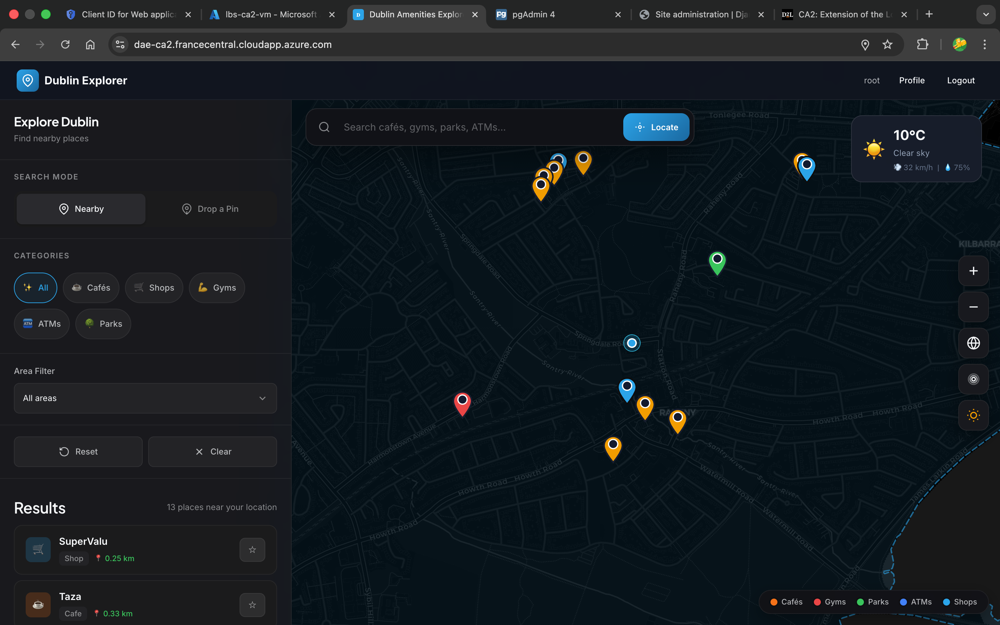
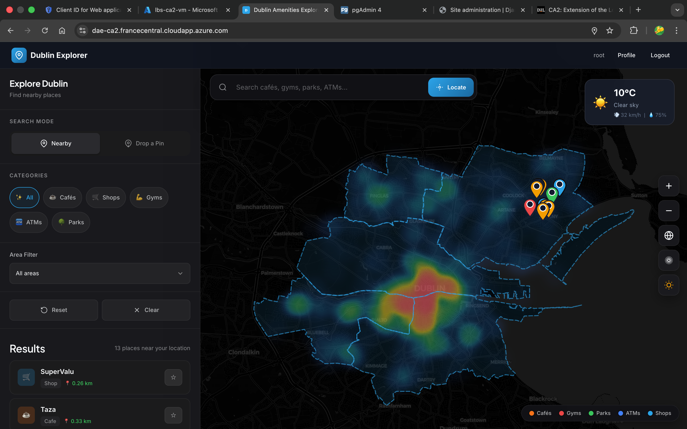
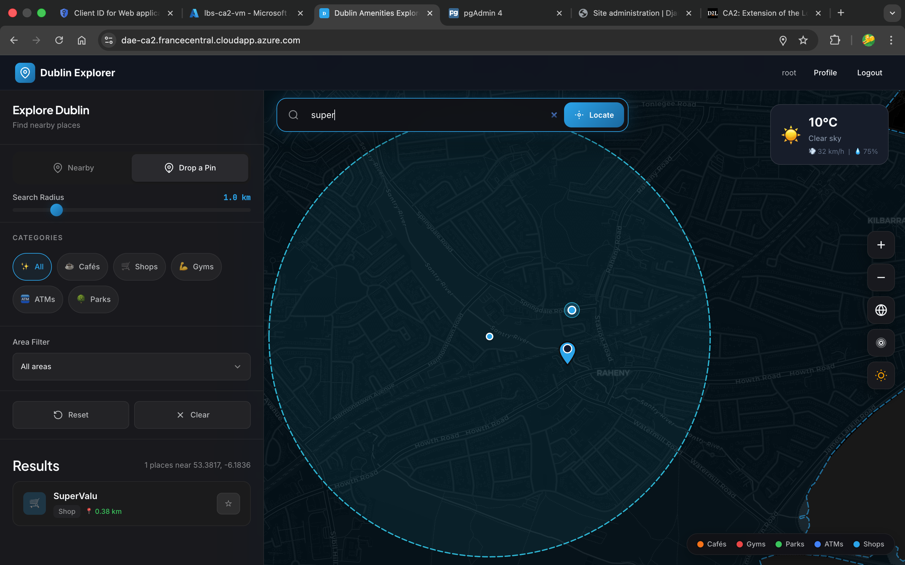
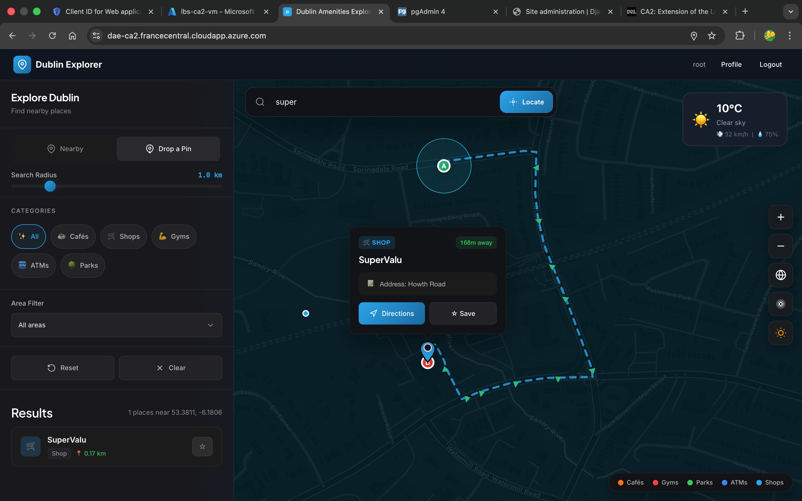

# Dublin Amenities Explorer

**CA2 - Web Mapping & Location Based Services**  
**TU Dublin - 4th Year Computer Science**

An interactive map application for exploring amenities and walking routes around Dublin. Built with Django, GeoDjango, PostGIS, and Leaflet.js.



## Demo

📱 **Mobile App Demo:** [Watch the screen recording](docs/demo/mobile-demo.mp4)

### Desktop Screenshots

| Heat Map View | Search Results | Routing |
|----------|----------------|---------|
|  |  |  |

---

## Features

- **Find Nearby Places** - Uses your GPS location to show closest amenities
- **Radius Search** - Drop a pin and search within a custom radius (0.2-5km)
- **Area Filtering** - Filter by Dublin administrative areas
- **Category Filters** - Cafés, shops, gyms, ATMs, parks
- **Walking Directions** - Get routes to any amenity using OSRM
- **Weather Widget** - Shows current conditions via Open-Meteo API
- **Heatmap View** - Visualise amenity density across Dublin
- **Favourites** - Save places when logged in (Google OAuth)
- **Dark/Light Mode** - Toggle theme for the map
- **Mobile Responsive** - Works on phone, tablet, and desktop

---

## Tech Stack

| Layer | Technology |
|-------|------------|
| **Backend** | Django 4.2, Django REST Framework |
| **Spatial** | GeoDjango, PostGIS 16, GEOS, GDAL |
| **Frontend** | Leaflet.js, Bootstrap 5, vanilla JS |
| **Database** | PostgreSQL 16 + PostGIS 3.5 |
| **Deployment** | Docker Compose, Nginx, Gunicorn |
| **Auth** | django-allauth (Google OAuth) |
| **APIs** | OSRM (routing), Open-Meteo (weather), Overpass (OSM data import) |

---

## Server Configuration

### Docker Compose Setup

The app runs 4 containers on a custom bridge network (`172.29.0.0/16`):

| Container | Image | IP Address | Port | Purpose |
|-----------|-------|------------|------|---------|
| `lbs_db` | postgis/postgis:16-3.5 | 172.29.0.2 | 5432 | PostgreSQL + PostGIS database |
| `lbs_web` | Custom Dockerfile | 172.29.0.3 | 8000 | Django app (Gunicorn) |
| `lbs_nginx` | nginx:latest | 172.29.0.4 | 8080→80 | Reverse proxy |
| `lbs_pgadmin` | dpage/pgadmin4:8.6 | 172.29.0.5 | 5050→80 | Database admin UI |

### Nginx Configuration

```nginx
upstream web {
    server web:8000;
}

server {
    listen 80;
    client_max_body_size 10M;
    
    # Security headers
    add_header Strict-Transport-Security "max-age=31536000; includeSubDomains";
    add_header X-Content-Type-Options "nosniff";
    add_header X-Frame-Options "SAMEORIGIN";
    
    # Gzip compression for performance
    gzip on;
    gzip_types text/plain text/css application/javascript application/json;
    
    # Static files with 30 day cache
    location /static/ {
        alias /app/staticfiles/;
        expires 30d;
    }
    
    # Proxy to Django
    location / {
        proxy_pass http://web;
        proxy_set_header Host $http_host;
        proxy_set_header X-Real-IP $remote_addr;
        proxy_set_header X-Forwarded-For $proxy_add_x_forwarded_for;
        proxy_set_header X-Forwarded-Proto $scheme;
    }
}
```

### Django Settings

Key configuration in `lbs/settings.py`:

```python
# Database - PostGIS backend
DATABASES = {
    "default": {
        "ENGINE": "django.contrib.gis.db.backends.postgis",
        "NAME": os.getenv("DB_NAME", "dae_db"),
        "HOST": os.getenv("DB_HOST", "127.0.0.1"),
        ...
    }
}

# Installed apps include GeoDjango and DRF
INSTALLED_APPS = [
    ...
    "django.contrib.gis",      # GeoDjango for spatial queries
    "rest_framework",          # REST API
    "rest_framework_gis",      # GeoJSON serialization
    "allauth",                 # Authentication
    "geo.apps.GeoConfig",      # Main app
]

# Static files served by WhiteNoise
STATICFILES_STORAGE = "whitenoise.storage.CompressedManifestStaticFilesStorage"
```

### Gunicorn Configuration

```bash
gunicorn --bind 0.0.0.0:8000 \
         --workers 4 \
         --worker-class sync \
         --timeout 60 \
         --forwarded-allow-ips='*' \
         lbs.wsgi:application
```

---

## Live Deployment

The app is hosted on an **Azure Virtual Machine** running Ubuntu:

🌐 **Live URL:** [https://dae-ca2.francecentral.cloudapp.azure.com](http://dae-ca2.francecentral.cloudapp.azure.com)

### Server Details

| Setting | Value |
|---------|-------|
| **Cloud Provider** | Microsoft Azure |
| **VM Type** | Standard B2s (2 vCPUs, 4GB RAM) |
| **OS** | Ubuntu 22.04 LTS |
| **Region** | France Central |
| **Domain** | dae-ca2.francecentral.cloudapp.azure.com |

### Deployment Process

1. Created Azure VM with Docker pre-installed
2. Cloned the repo to the server
3. Configured `.env` with production settings
4. Ran `docker compose up -d` to start all containers
5. Opened port 8080 in Azure Network Security Group

### Production Configuration

The following settings are enabled in production:

```python
# lbs/settings.py
ALLOWED_HOSTS = ["dae-ca2.francecentral.cloudapp.azure.com"]
CSRF_TRUSTED_ORIGINS = ["https://dae-ca2.francecentral.cloudapp.azure.com"]

# Security headers
SECURE_BROWSER_XSS_FILTER = True
X_FRAME_OPTIONS = "SAMEORIGIN"
```

---

## Running Locally

### Option 1: Docker (Recommended)

```bash
# Start all containers
docker compose up --build

# Access the app
# Web:      http://localhost:8080
# pgAdmin:  http://localhost:5050
```

### Option 2: Manual Setup

```bash
# Create virtual environment
python -m venv .venv
source .venv/bin/activate

# Install dependencies
pip install -r requirements.txt

# Create database with PostGIS extension
createdb dae_db
psql -d dae_db -c "CREATE EXTENSION postgis;"

# Configure environment
cp .env.example .env
# Edit .env with your database credentials

# Run migrations and load data
python manage.py migrate
python manage.py loaddata geo/fixtures/dcc_admin_areas.json
python manage.py loaddata geo/fixtures/amenities_dublin.json
python manage.py import_routes

# Start server
python manage.py runserver
# Visit http://127.0.0.1:8000
```

---

## API Endpoints

| Endpoint | Method | Description |
|----------|--------|-------------|
| `/api/amenities/` | GET | All amenities (GeoJSON) |
| `/api/amenities/nearest?lat=X&lng=Y&limit=30` | GET | Nearest amenities to point |
| `/api/amenities/radius?lat=X&lng=Y&km=2` | GET | Amenities within radius |
| `/api/amenities/search?q=starbucks` | GET | Search by name |
| `/api/areas/` | GET | Dublin admin areas |
| `/api/routes/` | GET | Walking routes |
| `/api/favourites/` | GET/POST/DELETE | User favourites (auth required) |

---

## Project Structure

```
├── geo/                    # Main Django app
│   ├── models.py          # Amenity, Area, Route, Favourite models
│   ├── views.py           # API endpoints
│   ├── serializers.py     # GeoJSON serialization
│   └── management/
│       └── commands/
│           ├── import_routes.py        # Load route data
│           └── import_osm_amenities.py # Import from Overpass API
├── templates/
│   └── map.html           # Main map interface
├── static/
│   ├── css/app.css        # Styles
│   └── js/
│       ├── routing.js     # OSRM routing module
│       └── weather.js     # Weather widget
├── lbs/
│   ├── settings.py        # Django config
│   └── urls.py            # URL routing
├── deploy/
│   └── nginx.conf         # Nginx configuration
├── docker-compose.yml     # Container orchestration
└── Dockerfile             # Web container build
```

---

## Spatial Queries Used

The app uses several PostGIS spatial functions:

1. **ST_DWithin** - Find amenities within a distance
2. **ST_Distance** - Calculate distance between points
3. **ST_Within** - Check if point is inside polygon
4. **ST_Intersects** - Find routes that cross an area

Example from `views.py`:
```python
origin = Point(lng, lat, srid=4326)
qs = Amenity.objects.annotate(
    distance=Distance("location", origin)
).filter(
    location__distance_lte=(origin, D(km=km))
).order_by("distance")
```

---

## Mobile App

The `/mobile` folder contains a Cordova wrapper that packages the web app as an Android APK. It uses:
- `cordova-plugin-geolocation` for GPS access
- `cordova-plugin-inappbrowser` for OAuth login

Build with:
```bash
cd mobile
cordova build android
```

---

## Environment Variables

Create a `.env` file with:

```env
SECRET_KEY=your-secret-key
DEBUG=True
DB_NAME=dae_db
DB_USER=postgres
DB_PASSWORD=postgres
DB_HOST=127.0.0.1
DB_PORT=5432

# For Google OAuth (optional)
GOOGLE_CLIENT_ID=your-client-id
GOOGLE_CLIENT_SECRET=your-client-secret
```

---

## Credits

- Map tiles: [CARTO](https://carto.com/) (dark/light themes), [Esri](https://www.esri.com/) (satellite)
- Amenity data: [OpenStreetMap](https://www.openstreetmap.org/) via Overpass API
- Routing: [OSRM](https://project-osrm.org/)
- Weather: [Open-Meteo](https://open-meteo.com/)
- Icons: [Bootstrap Icons](https://icons.getbootstrap.com/)
